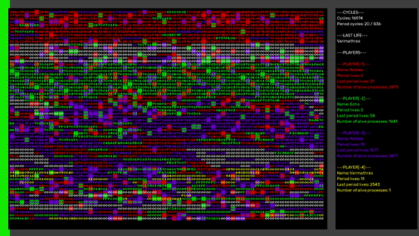
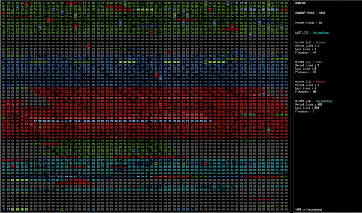

# Corewar
## Overview
Our own implementation of the famous 1984's [Corewar](https://en.wikipedia.org/wiki/Core_War) game.

## Assembler
### Overview
Used to compile '.s' pseudo-assembly champions into '.cor' binaries readable by the Virtual Machine.

### Usage
```
./asm [files .s]
```
## Virtual Machine
### Overview
Run the aforementioned binaries and provide options to visualize the execution.

### Usage
```
./corewar [-d | -v | -V | -z] [-dump nbr_cycles] [[-n number] champion1.cor] ... Max 4 players
  -d: Debug mode (output on STDERR, combinable with -V)
  -v: Verbose mode
  -V: Visual mode
  -z: Ncurse mode
```
### Visualizers
#### Go
```./corewar -V [champions.cor] | ./visu ```
  



#### Ncurses
``` ./corewar -z [champions.cor]```
  



## Footnotes
### Resources used
[Corewar 42's subject (FR)](resources/docs/corewar.fr.pdf)
  
[Corewar 42's subject (EN)](resources/docs/corewar.en.pdf)
  
[Corewar Operations by Jyeo](https://github.com/rizkyario/corewar/blob/master/resources/corewar_operations_by_jyeo.pdf)
  
[Corewar Operations Cheatsheet](resources/docs/Corewar_Cheat_Sheet.pdf)
  
